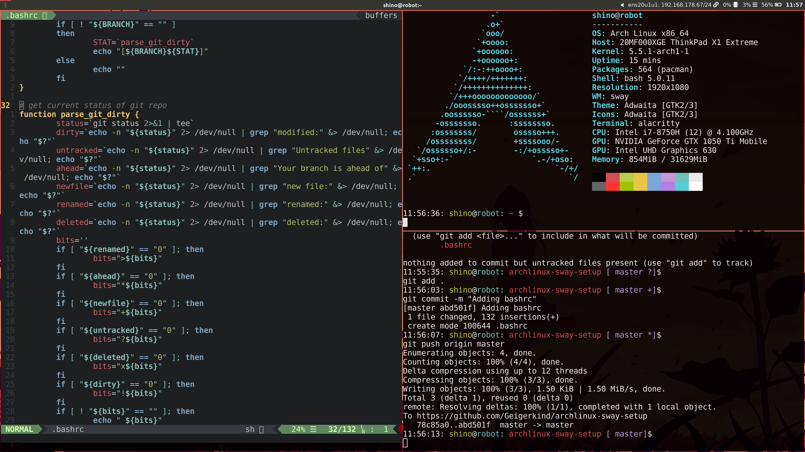

# Introduction
This example is a dual boot Lenovo Thinkpad X1 Extreme. Prior to installation:
* Disable Secure-Boot and Fast startup
* Shrink disk volume if you want to dual boot windoof

# Installation
**Change the keyboard layout**  
`loadkeys de-latin1`   

**Adjust TTY font size**  
`cd /usr/share/kbd/consolefonts`  
`ls | grep -P "[2-9]\d+\.ps"`  // Find big fonts.  
`setfont latarcyrheb-sun32` // Use the biggest one you can find.  

**Set up an internet connection**  
`wifi-menu` // I need to use wifi  

**Find available disks**  
`fdisk -l`  

**Format disk**  
`fdisk /dev/nvme0n1`  

**Optionally delete partitions**  
`d, enter, select patition, repeat...`  

**Create new partitions**  
`n (new), p (primary) for gpt it looks different`  

**The following partitions are required:**  
1. boot: Sequence: n, p, enter, +1GiB, enter
2. root: Sequence: n, p, enter, +100GiB, enter
3. swap: Sequence: n, p, enter, +32GiB, enter
4. home: Sequence: n, p, enter, enter

**Format all disks**  
`mkfs.ext4 /dev/nvme0n1p5` // In my case 1-4 is taken up by windoof  
`mkfs.ext4 /dev/nvme0n1p6`  
`mkfs.ext4 /dev/nvme0n1p8`  

**Setup swap**  
`mkswap /dev/nvme0n1p7`  
`swapon /dev/nvmeon1p7`  

**Mount the file system**  
`mount /dev/nvme0n1p6 /mnt`  
`mkdir /mnt/boot`  
`mkdir /mnt/home`  
`mount /dev/nvme0n1p5 /mnt/boot`  
`mount /dev/nvme0n1p8 /mnt/home`  
**DUALBOOT ONLY**  
`mkdir /mnt/boot/EFI`
`mount /dev/nvme0n1p1 /mnt/boot/EFI`

**Install ArchLinux**  
`pacstrap /mnt base linux linux-firmware`  
`genfstab -U /mnt >> /mnt/etc/fstab`  

**Get into your arch**  
`arch-chroot /mnt`  

**Install an editor**  
`pacman -S vim`  

**Setup the locale**  
`vim /etc/locale.gen` // Uncomment your locale  
`locale-gen`  
`echo LANG=en_US.UTF-8 > /etc/locale.conf` // Analogously, your language  
`export LANG=en_US.UTF-8`  
`export KEYMAP=de-latin1`  
`echo KEYMAP=de-latin1 > /etc/vconsole.conf`  

**Setup your time zone**  
`ln -sf /usr/share/zoneinfo/Region/City /etc/localtime` // Replace Region/City with your region  
`hwclock --systohc`  

**Setup your network configuration**  
`echo robot > /etc/hostname`  
`echo "127.0.0.1 localhost" >> /etc/hosts`  
`echo "::1 localhost" >> /etc/hosts`  
`echo "127.0.1.1 robot.localdomain robot" >> /etc/hosts`  

**Install your bootloader of choice, I use grub, cause Im a scrub and dont know better**  
`pacman -S grub efibootmgr os-prober`  
`grub-install --target=i386-pc /dev/nvme0n5` // If you DONT use dual boot  
`grub-install --target=x86_64-efi --bootloader-id=GRUB --efi-directory=/boot/EFI /dev/nvme0n1p5` // If you use dual boot  
`grub-mkconfig -o /boot/grub/grub.cfg`  

**Setup root password**  
`passwd`  

**Create sudo account**  
`pacman -S sudo`  
`useradd -m -g wheel shino`  
`passwd shino`  
`vim /etc/sudoers` // Uncomment wheel group  

**Install system components**  
`su shino`  

**Fonts**
`sudo pacman -S noto-fonts noto-fonts-cjk noto-fonts-extra noto-fonts-emoji ttf-liberation ttf-dejavu ttf-roboto ttf-inconsolata ttf-font-awesome ttf-ubuntu-font-family`

**Essentials**  
`sudo pacman -S zip unzip tar unrar wget htop clang cmake git python openssh npm pacman-contrib firefox alacritty linux-headers bash-completion pkgconfig autoconf automake man p7zip bzip2 zstd xz gzip`  

**Java**  
`sudo pacman -S jre-openjdk jdk-openjdk`  
`sudo archlinux-java set java-13-openjdk`

**Programming related**  
`sudo pacman -S neovim rustup go docker docker-compose`  
`sudo systemctl enable docker`  

**Audio**  
`sudo pacman -S alsa-utils pulseaudio pavucontrol`  

**Network**  
`sudo pacman -S networkmanager dhcpcd`  
`sudo systemctl enable NetworkManager`  

**Graphics**  
`sudo pacman -S bumblebee mesa xf86-video-intel nvidia-dkms qt5-wayland clutter glfw-wayland glew-wayland mesa vulkan-radeon libva-mesa-driver mesa-vdpau`  
`sudo gpasswd -a shino bumblebee` // Hybrid graphics only  
`sudo systemctl enable bumblebeed.service`  

**Applications**  
`sudo pacman -S code thunar thunderbird discord signal-desktop exa intellij-idea-community-edition`  

**Window manager**  
`sudo pacman -S sway swayidle swaylock swaybg waybar brightnessctl`

**Yay**  
`cd`  
`git clone https://aur.archlinux.org/yay.git`  
`cd yay`  
`makepkg`  
`sudo pacman -U yay-9.4.4-1-x86_64.pkg.tar.xz`  
`cd ..`  
`rm -rf yay`  

**Decreasing makepkg compile time**  
`sudo sed -i 's/#MAKEFLAGS="-j2"/MAKEFLAGS="-j12"/g' /etc/makepkg.conf`

**Aur packages**  
`yay -S slack-desktop wofi ttf-d2coding ttf-muli intellij-idea-ultimate-edition firefox-beta-bin swayshot`  

**Required for brightnessctl to work**  
`sudo chmod u+s /usr/bin/brightnessctl`

**Placing dotfile**  
`cd`  
`mkdir .config`  
`cd .config`  
`mkdir sway`  
`mkdir wofi`  
`mkdir alacritty`  
`mkdir waybar`  
`git clone https://github.com/Geigerkind/archlinux-sway-setup`  
`cd archlinux-sway-setup`  
`ln -s ~/.config/archlinux-sway-setup/sway/config ~/.config/sway/config`  
`ln -s ~/.config/archlinux-sway-setup/wofi/style.css ~/.config/wofi/style.css`  
`ln -s ~/.config/archlinux-sway-setup/waybar/style.css ~/.config/waybar/style.css`  
`ln -s ~/.config/archlinux-sway-setup/waybar/config ~/.config/waybar/config`  
`ln -s ~/.config/archlinux-sway-setup/nvim ~/.config/nvim`  
`ln -s ~/.config/archlinux-sway-setup/alacritty/alacritty.yml ~/.config/alacritty/alacritty.yml`  
`ln -s ~/.config/archlinux-sway-setup/swayshot.sh ~/.config/swayshot.sh`  
`ln -s ~/.config/archlinux-sway-setup/.bashrc ~/.bashrc`  
`sudo cp -r getty@tty1.service.d/ /etc/systemd/system/`  
`sudo cp -r getty@tty2.service.d/ /etc/systemd/system/`  
`sudo cp environment /etc/environment`  
`sud cp ~/.config/archlinux-sway-setup/backgrounds/* /usr/share/backgrounds/`  

**Installing Neobundle**  
`cd`  
`curl https://raw.githubusercontent.com/Shougo/neobundle.vim/master/bin/install.sh > install.sh`  
`bash install.sh`  
`rm install.sh`  
`cd ..`  

**Creating directories in home**  
`cd`  
`mkdir Repos`  
`mkdir Work`  
`mkdir Screenshots`  

**Disabling other users processes in top etc.**  
`sudo -s`  
`echo "proc /proc proc defaults,nosuid,nodev,noexec,relatime,hidepid=2 0 0" >> /etc/fstab`  
`exit`  
